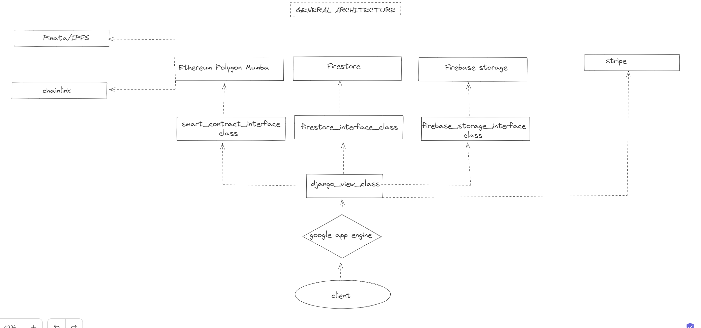

# Web3 backend and smart contract development for Python developers: Musical NFTs part 1

In following set of posts I will be focused on `Python` based web3 backend development. This subject by itself is quite immense. It is `Python` web2 backend plus peculiarities of web3 world. This will include smart contract writing, testing and deployment to `Polygon` test-net `Mumbai` or similar with Brownie. Ones we have this in place we will move to `DjangoREST` backend and full integration with `Google cloud` platform services like `Firestore` (NoSQL database), `Firebase storage` and `Google authentication`. Also on the way we will integrate our web3 app with `Chainlink` VRF, `IPFS` (via `Pinata`) for NFT metadata, `Stripe` (for potential NFT credit card buyers) and few other services. Finally ones all this is done we will deploy our app to `Google App engine` from where our APIs will be available. 

General architecture should look something like this =>



### What we will build?

We will make API endpoints that can be consumed by client and through them provide interaction with smart contracts and normal backend functionalities like sign-up, login etc. Smart contracts will be coded in Solidity and main idea behind will be idea of musical NFTs. Imagine that musical company can issue certain number of trackpacks per batch. User then can buy one or more trackpacks with credit card or with crypto without knowing which songs are inside. Then we will provide to them opening functionality through which they will be able to initiate opening process (similar to opening of package of physical thumbnails). Ones he initiate opening process of his trackpack NFT we will use Chainlink VRF (verifiable random function) to randomly assign 5 NFT songs from musical company catalog to user address or to custodial wallet (in case of credit card buyers). In short something like blockchain version of musical NFT thumbnails. 


### But first things first: diving equipment!

Let's talk shortly about equipment we plan to use for this deep dive and environment in which we will build. I'm working on `Ubuntu 20.04.6` over `Windows WSL` and Im using `Python 3.8.10`. Then we will need to PIP install few packages and to create Python virtual environment. I'm using `venv` but you are free to use what ever you find most suitable for you. Then we will build our APIs with `Django REST` framework version 3.14.0 and develop smart contracts with `Brownie`. Backend interaction with deployed smart contract will be done through web3.py. For testing `Pytest` + few SDKs to manage our relation to Google cloud services and Stripe. As you can see  our tech stack is quite conventional. Maybe in context when we work over Google cloud with NoSql database and Google authentication Django REST can be seen as overkill (because we don't use his ORM layer at all in first phase of project). And maybe from this point of view is logical to opt for some more light Python framework like FastAPI. But we will stick to Django because at certain point we will develop also alternative version of our app that use SQL database and have Django native authentication mechanism in place. For version control we will use Git and then project code will be available over Github. 

And now let's do what our fellow Apes on Earth like to do for the centuries "Build that rocket and fly to motherfucking space..."      

<br/>
<br/>
<br/>
<br/>
<br/>

# Web3 backend and smart contract development for Python developers: Musical NFTs part 2


We will build few versions of this project: 
Pure Django + postgres db; 
Django REST, REACT for front-end + sql database; 
Django REST, React front-end and Google cloud (firestore noSql db, google storage and authentication). 

What means in third version we will avoid whole ORM layer of Django and substitute with Google services (a bit atypical combination).     


There will be two options here:

### Simple Git clone
In this option you can simple git clone project, run Django server locally and  play with functionalities and code. 

    # make dir and clone project github repo
    $md musical_nft_thumbnails && cd musical_nft_thumbnails 
    
    $git clone https://github.com/ilijapet/musical_nft_thumbnails.git .

    # you need to have env or similar enviroment manager
    $python -m venv env && source env/bin/activate
    
    # you need to have pip installed
    $pip install -r requirements.txt
    
    # run django server
    $python manage.py runserver

Now you can go to `http://127.0.0.1:8000/` and play with app. Or change source as you find most suitable. 

### Step by step guide

Second option is focused more on process for devs interested in how to put all this things together.

    $md musical_nft_thumbnails && cd musical_nft_thumbnails
    $git init
    # Create .gitignore with our future env folder
    $echo "env/" > .gitignore
    $git add -A
    $ git commit -m "First commit"
    $git branch -M main

Go go Github repo and create new repo:


<br/>
<br/>


        
<br/>
<br/>

    # add name of your branch
    $git remote add origin https://github.com/ilijapet/musical_nft_thumbnails.git
    $git push -u origin main

At this point we have local git repo, initial commit and code in your github repo. 


Lets create virtual environment and activate them: 

    $python -m venv env && source env/bin/activate

At this point we have local git, dedicated and with local git connected Github repo as well as local virtual environment created and activated. 

Now lets install Django and create our requirements.txt  
    # install django
    $pip install django

    # create requirements.txt
    $pip freeze > requirements.txt


Basically from this point we are ready to start writing the coding. But before that here is picture of overall architecture. 


<br/>

Client send some request to our backend server, routed through urls our app
views will handle the call. Read and write from sql database. Communicate with our smart contract when needed. Bake together all this processed data and return page to client. Fairly standard flow except web3 element and Chanilink and Polygon testnet Mumbai.   

<br/>
<br/>
<br/>
<br/>
<br/>

# Web3 backend and smart contract development for Python developers Musical NFTs part 3: postgras database integration

### Installing postgres database

Postgres installation procedure is written for WLS environment and it will presume that you already have WSL installed on your machine. If that's not the case go first to WSL documentation. (If you want to check if you have WSL already installed just can go to windows command line and type `wsl -l -v`)


Installation from Linux terminal
```
$ sudo sh -c 'echo "deb http://apt.postgresql.org/pub/repos/apt $(lsb_release -cs)-pgdg main" > /etc/apt/sources.list.d/pgdg.list'
 
$ wget --quiet -O - https://www.postgresql.org/media/keys/ACCC4CF8.asc | sudo apt-key add -
 
$ sudo apt-get update
 
$ sudo apt-get -y install postgresql postgresql-contrib
 
$ psql --version
psql (PostgreSQL) 15.2 (Ubuntu 15.2-1.pgdg22.04+1)
 
$ sudo service postgresql status
15/main (port 5432): down

#starting server 
$ sudo service postgresql start
 * Starting PostgreSQL 15 database server
```

### Starting new Django project and adding postgres to our settings.py file

Let's first install Django from virtual environment

    $ pip install django
    # update requirments
    $ pip freeze > requirements.txt

This will install latest Django stabile version and add Django to our requirements.txt

To check if everything went well type

    $python -m django --version
    4.2.5

Now we will create new project in root directory `musical_nft_thumbnails`

    $django-admin startproject musical_nft .

Now project root folder should look something like this:

    
    ├── env
    ├── manage.py
    ├── musical_nft
    └── requirements.txt


In attempt to test Django and if everything worked as expected we should

    $python manage.py runserver

If everything goes well we should see something like

    Watching for file changes with StatReloader
    Performing system checks...

    System check identified no issues (0 silenced).

    You have 18 unapplied migration(s). Your project may not work properly until you apply the migrations for app(s): admin, auth, contenttypes, sessions.
    Run 'python manage.py migrate' to apply them.
    September 21, 2023 - 20:03:07
    Django version 4.2.5, using settings 'musical_nft.settings'
    Starting development server at http://127.0.0.1:8000/
    Quit the server with CONTROL-C.


### Creatig user and new database 


    $sudo service postgresql start
    * Starting PostgreSQL 15 database server [ OK ] 
    * Starting PostgreSQL 9.1 database server 

    # now lets go to postgres command line and create user with password and give premisions to newly created user  
    $sudo -u postgres psql
    psql (15.4 (Ubuntu 15.4-1.pgdg20.04+1))
    Type "help" for help.

    # create database
    postgres=#create database musical_nfts;

    # create user
    postgres=# create user denisdb with encrypted password 'testpassword';
    
    # grant all privileges to newly created database to user denisdb
    postgres=# grant all privileges on database musical_nfts to denisdb;

    # change database ownership to avoid problem when executing migratations in Django 
    postgres=# ALTER DATABASE musical_nfts OWNER TO denisdb;

Exit postgres comand line and install Python package `psycopg2` (Psycopg is the most popular PostgreSQL database adapter for the Python programming language)

    $pip install psycopg2
    $pip freeze > requirements.txt

Before we move to `settings.py` let's install `django-environ` library for
managing environment variables in our project.

    $pip install django-environ
    $pip freeze > requirements.txt

In root folder create file `.env` and write inside:

    DENIS_PASS=testpassword

Add `.env` to our `.gitignore` file.

    env/
    .env


Inside `musical_nft` folder you should now be able to find and open `settings.py`

On the top of Django `settings.py` file, above security variable you can pass:

    from pathlib import Path
    import os
    import environ

    # Build paths inside the project like this: BASE_DIR / 'subdir'.
    BASE_DIR = Path(__file__).resolve().parent.parent


    env = environ.Env()
    env_file = os.path.join(BASE_DIR, ".env")
    if os.path.isfile(env_file):
        # read a local .env file
        env.read_env(env_file)
        password = env("DENIS_PASS")
    else:
        raise ValueError("We cannot find .env file")
    
    SECRET_KEY = "django-insecure-#!!l7=be79=9h#ng$+l4mgxp$p6n7^boxvqnd!(x8vxx)##+4m"


Then over database setting inside Django `settings.py` you can pass

    DATABASES = {
    "default": {
        "ENGINE": "django.db.backends.postgresql",
        "NAME": "musical_nfts",
        "USER": "denisdb",
        "PASSWORD": password,
        "HOST": "localhost",
        "PORT": "",
    }
}


When you run your Django you should see something like this

    $python manage.py runserver
    Watching for file changes with StatReloader
    Performing system checks...

    System check identified no issues (0 silenced).

    You have 18 unapplied migration(s). Your project may not work properly until you apply the migrations for app(s): admin, auth, contenttypes, sessions.
    Run 'python manage.py migrate' to apply them.
    September 22, 2023 - 00:41:37
    Django version 4.2.5, using settings 'musical_nft.settings'
    Starting development server at http://127.0.0.1:8000/
    Quit the server with CONTROL-C.


 
Django comes with some pre-coded models that we need to migrate even if we didn't add neither one app model. That is why now is time to make Django migrations and to erase error we got above: 
`    You have 18 unapplied migration(s). Your project may not work properly until you apply the migrations for app(s): admin, auth, contenttypes, sessions.
    Run 'python manage.py migrate' to apply them.
`


    $python manage.py makemigrations
    $python manage.py migrate

    Operations to perform:
    Apply all migrations: admin, auth, contenttypes, sessions
    Running migrations:
    Applying contenttypes.0001_initial... OK
    Applying auth.0001_initial... OK
    Applying admin.0001_initial... OK
    Applying admin.0002_logentry_remove_auto_add... OK
    Applying admin.0003_logentry_add_action_flag_choices... OK
    Applying contenttypes.0002_remove_content_type_name... OK
    Applying auth.0002_alter_permission_name_max_length... OK
    Applying auth.0003_alter_user_email_max_length... OK
    Applying auth.0004_alter_user_username_opts... OK
    Applying auth.0005_alter_user_last_login_null... OK
    Applying auth.0006_require_contenttypes_0002... OK
    Applying auth.0007_alter_validators_add_error_messages... OK
    Applying auth.0008_alter_user_username_max_length... OK
    Applying auth.0009_alter_user_last_name_max_length... OK
    Applying auth.0010_alter_group_name_max_length... OK
    Applying auth.0011_update_proxy_permissions... OK
    Applying auth.0012_alter_user_first_name_max_length... OK
    Applying sessions.0001_initial... OK
    

At this point we can start to build our backend.


# Web3 backend and smart contract development for Python developers Musical NFTs part 4: Smart contract development with Brownie

From dependency for smart contract part we will need `Brownie` framework. This is `Python` based smart contract development framework. (There is new kid in the block `ApeWorX` framework which will be considered for some other article in this seria)

Important thing to notice here is that often conflict can emerge between frameworks and libraries we use for our backend development and the one we use for smart contract development. That is why we need to create separate virtual environment only for smart contract development process. 

In our case this process involves writing smart contracts in `Solidity`, testing them with `Pytest` and deployment to `Polygon Mumbai` test-net. Ones we have our contract deployed on Polygon Mumbai we will go back to Django and plug our contracts to apps views to handle communication between client and smart contracts.

But first let's deactivate current `Django` virtual environment, make new smart contract folder, create new Python virtual environment and install few dependencies.

    # deactivate virtual environment
    $deactivate

    #create and cd into smart-contract folder
    $md smart-contracts && cd smart-contracts
    
    # create and activate new python virtual environment 
    $python -m venv env && source env/bin/activate
    
    # pip install eth-brownie
    $pip install eth-brownie

    # create new local requirements.txt
    $pip freeze > requirements.txt

Restart your console and type `brownie` to check if installation was done properly

    $brownie
    Brownie v1.19.3 - Python development framework for Ethereum

    Usage:  brownie <command> [<args>...] [options <args>]

    Commands:
    init               Initialize a new brownie project
    bake               Initialize from a brownie-mix template
    pm                 Install and manage external packages
    compile            Compile the contract source files
    console            Load the console
    test               Run test cases in the tests/ folder
    run                Run a script in the scripts/ folder
    accounts           Manage local accounts
    networks           Manage network settings
    gui                Load the GUI to view opcodes and test coverage
    analyze            Find security vulnerabilities using the MythX API

    Options:
    --help -h          Display this message
    --version          Show version and exit

    Type 'brownie <command> --help' for specific options and more information about
    each command.


Now let's install Ganache-cli (for more information go to https://github.com/trufflesuite/ganache). Ganache is Ethereum simulator for your local machine.
To install Ganche on your local machine you need to have & install: 
`Node.js >=v16.0` and `npm >=7.10.0`

Ones you have this successfully installed then type to command line:

    $ npm install ganache --global


To confirm that you have Ganache type

    $ ganche
    Ganache CLI v6.12.1 (ganache-core: 2.13.1)

    Available Accounts
    ==================
    (0) 0xe261e26aECcE52b3788Fac9625896FFbc6bb4424 (100 ETH)
    (1) 0xcE16e8eb8F4BF2E65BA9536C07E305b912BAFaCF (100 ETH)
    (2) 0x02f1c4C93AFEd946Cce5Ad7D34354A150bEfCFcF (100 ETH)
    (3) 0x0B75F0b70076Fab3F18F94700Ecaf3B00fE528E7 (100 ETH)
    (4) 0x7194d1F1d43c2c58302BB61a224D41B649e65C93 (100 ETH)
    (5) 0xC9A2d92c5913eDEAd9a7C936C96631F0F2241063 (100 ETH)
    (6) 0xD79BcDE5Cb11cECD1dfC6685B65690bE5b6a611e (100 ETH)
    (7) 0xb6D080353f40dEcA2E67108087c356d3A1AfcD64 (100 ETH)
    (8) 0x31A064DeeaD74DE7B9453beB4F780416D8859d3b (100 ETH)
    (9) 0x37524a360a40C682F201Fb011DB7bbC8c8A247c6 (100 ETH)

    Private Keys
    ==================
    (0) 0x7f109a9e3b0d8ecfba9cc23a3614433ce0fa7ddcc80f2a8f10b222179a5a80d6
    (1) 0x6ec1f2e7d126a74a1d2ff9e1c5d90b92378c725e506651ff8bb8616a5c724628
    (2) 0xb4d7f7e82f61d81c95985771b8abf518f9328d019c36849d4214b5f995d13814
    (3) 0x941536648ac10d5734973e94df413c17809d6cc5e24cd11e947e685acfbd12ae
    (4) 0x5829cf333ef66b6bdd34950f096cb24e06ef041c5f63e577b4f3362309125863
    (5) 0x8fc4bffe2b40b2b7db7fd937736c4575a0925511d7a0a2dfc3274e8c17b41d20
    (6) 0xb6c10e2baaeba1fa4a8b73644db4f28f4bf0912cceb6e8959f73bb423c33bd84
    (7) 0xfe8875acb38f684b2025d5472445b8e4745705a9e7adc9b0485a05df790df700
    (8) 0xbdc6e0a69f2921a78e9af930111334a41d3fab44653c8de0775572c526feea2d
    (9) 0x3e215c3d2a59626a669ed04ec1700f36c05c9b216e592f58bbfd3d8aa6ea25f9

    HD Wallet
    ==================
    Mnemonic:      candy maple velvet cake sugar cream honey rich smooth crumble sweet treat
    Base HD Path:  m/44'/60'/0'/0/{account_index}

    Default Gas Price
    ==================
    20000000000

    Gas Limit
    ==================
    6721975

    Call Gas Limit
    ==================
    9007199254740991

    Listening on 127.0.0.1:8545

Now lets intialize new project with `Brownie` inside `smart-contract` folder. Intialization of new project need to be done inside empty folder. 

    $md brownie_musical_nfts && brownie_musical_nfts
    $brownie init
    Brownie v1.19.3 - Python development framework for Ethereum

    SUCCESS: A new Brownie project has been initialized at /home/code/my_tutorials/musical_nft_thumbnails/smart-contracts/brownie_musical_nfts

We will create one test smart contract and try to compile to see if everyting 
works well. Inside contract folder create `nft_package.sol` file.

    // SPDX-License-Identifier: MIT

    pragma solidity 0.8.13;

    contract NftPackage {

        uint256 public test = 10;
        
    }


Compiling newly created test smart contract


    brownie compile
    Brownie v1.19.3 - Python development framework for Ethereum

    Compiling contracts...
    Solc version: 0.8.13
    Optimizer: Enabled  Runs: 200
    EVM Version: Istanbul
    Generating build data...
    - NftPackage

    Project has been compiled. Build artifacts saved at /home/ilija/code/my_tutorials/musical_nft_thumbnails/smart-contracts/brownie_musical_nfts/build/contracts

Now we have fully functional `Brownie` project and we can move to writing our smart contract. 


# Web3 backend and smart contract development for Python developers Musical NFTs part 5: writing smart contract

We will use some of OpenZeppelin contracts here and that is why first we need to installed them. Brownie comes with of package manager we can use for this purpose. Universal sintax is `brownie pm install [ORGANIZATION]/[REPOSITORY]@[VERSION]` in our case

    $brownie pm install OpenZeppelin/openzeppelin-contracts@4.5.0
    #check if package is properly installed
    $brownie pm list
    Brownie v1.19.3 - Python development framework for Ethereum

    The following packages are currently installed:

    OpenZeppelin
    └─OpenZeppelin/openzeppelin-contracts@4.5.0


Now in our `nft_package.sol` test contract try to import newly installed OpenZeppelin contract ERC721. Open `nft_package.sol` from `./contracts`

    // SPDX-License-Identifier: MIT

    # Here we are importing newly installed ERC721 contract
    import "OpenZeppelin/openzeppelin-contracts@4.5.0/contracts/token/ERC721/ERC721.sol";

    #defining compiler
    pragma solidity 0.8.13;

    contract NftPackage {

        uint256 public test = 10;
        
    }

<br>

    $brownie compile
    Brownie v1.19.3 - Python development framework for Ethereum

    Compiling contracts...
    Solc version: 0.8.13
    Optimizer: Enabled  Runs: 200
    EVM Version: Istanbul
    Generating build data...
    - OpenZeppelin/openzeppelin-contracts@4.5.0/ERC721
    - OpenZeppelin/openzeppelin-contracts@4.5.0/IERC721
    - OpenZeppelin/openzeppelin-contracts@4.5.0/IERC721Receiver
    - OpenZeppelin/openzeppelin-contracts@4.5.0/IERC721Metadata
    - OpenZeppelin/openzeppelin-contracts@4.5.0/Address
    - OpenZeppelin/openzeppelin-contracts@4.5.0/Context
    - OpenZeppelin/openzeppelin-contracts@4.5.0/Strings
    - OpenZeppelin/openzeppelin-contracts@4.5.0/ERC165
    - OpenZeppelin/openzeppelin-contracts@4.5.0/IERC165
    - NftPackage

    Project has been compiled. Build artifacts saved at /my_tutorials/musical_nft_thumbnails/smart-contracts/brownie_musical_nfts/build/contracts

We successfully imported OpenZepplein ERC721 inside our contract and now we can start to code our Muscial NFT contract.

Basic idea here is to have musical NFT based on `ERC721` contract with few basic functionalities like minting and adding tokenURI. Then we will inherit from few basic `OpenZepellin` contracts like `ownable` (track and manage via modifier who have right to call certain functions), `counters` (mainly count number of newly minted tokens) and `URIStorage` (linking our newly minted NFT to NFT metadata on IPFS).

I will write whole contract here and explain with inline comments what is going one (very useful tool for this kind of basic contracts and experimentation is [OpenZepelinWizard](https://www.openzeppelin.com/contracts))

We will deploy two main contracts: MockUSDC and MusicNFT. MockUSDC is basically ERC20 that mimic USDC on Mumbai testnet. Reason why we did't use real test USDC is fact that is very hard to obtain them on Mumbai and MockUSDC will play that role very well. Second contract is ERC721 where we simply mint new musical NFTs and assigne new URI. Here are contracts (with explanations inline):


    // SPDX-License-Identifier: MIT
    pragma solidity ^0.8.9;

    import "OpenZeppelin/openzeppelin-contracts@4.5.0/contracts/token/ERC20/ERC20.sol";
    import "OpenZeppelin/openzeppelin-contracts@4.5.0/contracts/access/Ownable.sol";

    contract MockUSDC is ERC20, Ownable {
            // Mint to deoployer all MUSDC tokens
            constructor() ERC20("MockUSDC", "MUSDC") {
            _mint(msg.sender, 1000000000000000 * 10 ** decimals());
        }
    }

    Brownie v1.19.3 - Python development framework for Ethereum

    Compiling contracts...
    Solc version: 0.8.21
    Optimizer: Enabled  Runs: 200
    EVM Version: Istanbul
    Generating build data...
    - OpenZeppelin/openzeppelin-contracts@4.5.0/Ownable
    - OpenZeppelin/openzeppelin-contracts@4.5.0/ERC20
    - OpenZeppelin/openzeppelin-contracts@4.5.0/IERC20
    - OpenZeppelin/openzeppelin-contracts@4.5.0/IERC20Metadata
    - OpenZeppelin/openzeppelin-contracts@4.5.0/Context
    - MockUSDC

    Project has been compiled. Build artifacts saved at /home/ilija/code/my_tutorials/musical_nft_thumbnails/smart-contracts/brownie_musical_nfts/build/contracts

We have our mock token ready to be used

And here is MusicNFT contracts


    // SPDX-License-Identifier: MIT
    pragma solidity ^0.8.9;

    import "OpenZeppelin/openzeppelin-contracts@4.5.0/contracts/token/ERC721/ERC721.sol";
    import "OpenZeppelin/openzeppelin-contracts@4.5.0/contracts/token/ERC721/extensions/ERC721URIStorage.sol";
    import "OpenZeppelin/openzeppelin-contracts@4.5.0/contracts/access/Ownable.sol";
    import "OpenZeppelin/openzeppelin-contracts@4.5.0/contracts/utils/Counters.sol";
    import "OpenZeppelin/openzeppelin-contracts@4.5.0/contracts/token/ERC20/IERC20.sol";


    contract MusicNFT is ERC721, ERC721URIStorage, Ownable {
        using Counters for Counters.Counter;

        Counters.Counter private _tokenIdCounter;

        IERC20 public immutable USDC;

        uint256 public immutable maxNFT;

        uint256 public NFTPriceInUSDC;

        // Event to be emited ones we mint new NFT token
        event newNFTMinted(uint256 numberOfNFT, address owner);

        // Event to be emited ones new price is setted
        event newPrice(string message, uint256 newPrice);

        constructor(address _usdc, uint256 _maxNft) ERC721("MyToken", "MTK") {
            // instatiating mock ERC20 token (that we previusly deployed)
            USDC = IERC20(_usdc);    
            // Defining maximum number of tokens this contract cna mint
            maxNFT = _maxNft;     
        }


        /** 
            This function is used for minting new NFTs. We need to pass token uri (uniform resource 
            Identifier) from IPFS (via Pinata). Metadata of some NFT is basically 
            detail explanation of NFT content: characteristic, link to song in our 
            case and other relevant information. Second argument that we need to pass is number of 
            NFTs we want to buy
        */

        // For crypto buyers
        function buyNFT(string memory uri, uint256 nftCount) public {
            // Here we are cheking if desired number of NFTs is bigger then one
            require(nftCount > 0, "You have to mint at least one Track Pack NFT.");
            // Here we are cheking if number of already minted NFT is bigger then max allowed to be minted
            require(nftCount + _tokenIdCounter.current() <= maxNFT, "There aren't enough Track Pack NFTs for this drop for you to mint you amount you chose. Another drop will be available soon!");
            // Here we check if user balance in MockUSDC is bigger the number NFTs he want to buy * price of NFTs
            require(USDC.balanceOf(msg.sender) >= NFTPriceInUSDC * nftCount, "You don't have enough USDC to pay for the Track Pack NFT(s).");
            // Check if total amount of approved MOckUSDC to this contract tokens is bigger then number of NFTs * price  
            require(USDC.allowance(msg.sender, address(this)) >= NFTPriceInUSDC * nftCount, "You haven't approved this contract to spend enough of your USDC to pay for the Track Pack NFT(s).");
            // If everything goes ok then make MockUSDC tokens transfer from user account to this contract
            USDC.transferFrom(msg.sender, address(this), NFTPriceInUSDC * nftCount);
            // Take new NF token ID
            uint256 tokenId = _tokenIdCounter.current();
            // Increment counter
            _tokenIdCounter.increment();
            // Mint new token
            _safeMint(msg.sender, tokenId);
            // Set new token URI to token ID
            _setTokenURI(tokenId, uri);
            // Emit event about succesful minting
            emit newNFTMinted(tokenId, msg.sender);
        }
        
        // When credit card buyers buy new NFT we need to mint to custodial wallet. Same as beafore. Diffrence is: onnly owner can mint, 2. there is no need to pay in usdc
        // it is already done by credit card. 
        function createNFT(address custodialWallet, string memory uri, uint256 nftCount) public onlyOwner {
            uint256 tokenId = _tokenIdCounter.current();
            _tokenIdCounter.increment();
            _safeMint(custodialWallet, tokenId);
            _setTokenURI(tokenId, uri);
            emit newNFTMinted(tokenId, custodialWallet);
        }
        // This function is used to set new NFT price if necessary
        function setNFTPrice(uint256 _newPrice) public onlyOwner {
            NFTPriceInUSDC = _newPrice;
            emit newPrice("New price is seted", _newPrice);
        }

        // Get token URI function
        function tokenURI(uint256 tokenId)
            public
            view
            override(ERC721, ERC721URIStorage)
            returns (string memory)
        {
            return super.tokenURI(tokenId);
        }


        function supportsInterface(bytes4 interfaceId)
            public
            view
            override(ERC721)
            returns (bool)
        {
            return super.supportsInterface(interfaceId);
        }
        // The following functions are overrides required by Solidity.

        function _burn(uint256 tokenId) internal override(ERC721, ERC721URIStorage) {
            super._burn(tokenId);
        }

}


Now when we have our second contract written lets compile him to see if everything works well

    $brownie compile
    Brownie v1.19.3 - Python development framework for Ethereum

    Compiling contracts...
    Solc version: 0.8.21
    Optimizer: Enabled  Runs: 200
    EVM Version: Istanbul
    Generating build data...
    - OpenZeppelin/openzeppelin-contracts@4.5.0/Ownable
    - OpenZeppelin/openzeppelin-contracts@4.5.0/IERC20
    - OpenZeppelin/openzeppelin-contracts@4.5.0/ERC721
    - OpenZeppelin/openzeppelin-contracts@4.5.0/IERC721
    - OpenZeppelin/openzeppelin-contracts@4.5.0/IERC721Receiver
    - OpenZeppelin/openzeppelin-contracts@4.5.0/ERC721URIStorage
    - OpenZeppelin/openzeppelin-contracts@4.5.0/IERC721Metadata
    - OpenZeppelin/openzeppelin-contracts@4.5.0/Address
    - OpenZeppelin/openzeppelin-contracts@4.5.0/Context
    - OpenZeppelin/openzeppelin-contracts@4.5.0/Counters
    - OpenZeppelin/openzeppelin-contracts@4.5.0/Strings
    - OpenZeppelin/openzeppelin-contracts@4.5.0/ERC165
    - OpenZeppelin/openzeppelin-contracts@4.5.0/IERC165
    - MusicNFT

    Project has been compiled. Build artifacts saved at /home/ilija/code/my_tutorials/musical_nft_thumbnails/smart-contracts/brownie_musical_nfts/build/contracts

With this two contract ready for usage in next step we will deploy them on Mumbai and start with integration in our Django backend.


# Web3 backend and smart contract development for Python developers Musical NFTs part 6: deploy smart contract

In attempt to deploy our contracts to Polygon Mumbai test-net we will need to create few files: 1) .env (with account private keys); 2) `brownie-config.yaml` with Brownie related settings; 3) Python helper file with function which will define from which account we will deploy our contracts and last 4) `deploy.py` file which we will run from command line ones we decide to make a deployment. Also we will need some Mumbai testnet MATIC tokens that we can get from [faucet](https://faucet.polygon.technology/)


When it come to deployment we have two possibilities: deployment to local dev net like Ganache or to test-net like Mumbai. In our case we will first deploy to local Ganache blockchain and if everything goes well we will move to Mumbai test-net.


In root of smart-contract development folder create `.env` file and add 

    PRIVATE_KEY=here_you_should_pass_prvivate_keys_from_your_test_metamask_account_previously_funded_with_matic_mumbai_tokens
    MNEMONICS=here_you_can_copy_your_menmonics


IMORTANT: accounts you are using here must be the one you use for development purpose! 
Second, fact that we are adding here mnemonics will allow Brownie to generate eth address we use in MetaMask when he run Ganache.  

Add `.env` file to your `.gitignore` 

Now we will create `brownie-config.yaml` in our root directory. This file is used to define basic settings for our project and it should look something like this:


    dotenv: .env
    networks:
        development:
            cmd_settings:
                accounts: 20
                mnemonic: ${MNEMONIC}
                default_balance: 200

    compiler:
    solc:
        version: 0.8.13


    wallets:
    from_key: ${PRIVATE_KEY}


In this moment we only need simply deployment script and one helper function and we are ready for deployment.

In folder `./scripts` add two new files: `helpers.py` and `deploy.py`. Inside `helpers.py` write following code (I will give more detail with inline comment)


    from brownie import accounts, config, network

    def get_account():
        # cheking if devleopment neetwork is active. If yes return account on index position zero
        if network.show_active() == "development":
            return accounts[0]
        else:
            # if development network is not active then generate account from .env file and details youb pass there 
            return accounts.add(config["wallets"]["from_key"])


Then in `deploy.py` you can write 

    #!usr/bin/python3
    from brownie import MusicNFT, MockUSDC
    from scripts.helpers import get_account

    def main():
        # using get_account function from helpers.py file to pick proper eth account 
        account = get_account()
        
        # deploy MockUSDC contract and assigne deployment address to mockDeployed variable 
        mockDeployed = MockUSDC.deploy({"from": account})
        
        # pass address of MockUSDC contract to MusicNFT contract constructor 
        musciNFTdeployed = MusicNFT.deploy(mockDeployed, 5, {"from": account})


It is time to deploy to local development blockchain just to check if everything went well. We will run our deployment script with `-i` flag which will allow us to go to interactive mode and play with our contracts

    $brownie run deploy.py -i
    
    Brownie v1.19.3 - Python development framework for Ethereum

    BrownieMusicalNftsProject is the active project.
    This version of µWS is not compatible with your Node.js build:

    Error: Cannot find module './uws_linux_x64_111.node'
    Falling back to a NodeJS implementation; performance may be degraded.


    Launching 'ganache-cli --chain.vmErrorsOnRPCResponse true --server.port 8545 --miner.blockGasLimit 12000000 --wallet.totalAccounts 20 --hardfork istanbul --wallet.mnemonic attitude grant adjust accuse mail visual hammer potato nest interest breeze crime --wallet.defaultBalance 200'...

    Running 'scripts/deploy.py::main'...
    Transaction sent: 0xc8e3a13e26b0e5ce455143bd40e0646cb4bf7f1b66e2abdfae1c11f45dbdc656
    Gas price: 0.0 gwei   Gas limit: 12000000   Nonce: 0
    MockUSDC.constructor confirmed   Block: 1   Gas used: 775127 (6.46%)
    MockUSDC deployed at: 0xC155AfddDA33e079Dbf55093bc7bb7a6f695e29e

    Transaction sent: 0x40e5aa305e41c93b21ab70f28ec05c85b62e6a7a666026b77268e815ab82a25d
    Gas price: 0.0 gwei   Gas limit: 12000000   Nonce: 1
    MusicNFT.constructor confirmed   Block: 2   Gas used: 1899815 (15.83%)
    MusicNFT deployed at: 0x76326f78fd4B4fc34D34f5d731fb13773e3494C6


    Interactive mode enabled. Use quit() to close.
    >>> MusicNFT[0].name()
    'MuscialNFT'
    >>> MockUSDC[0].name()
    'MockUSDC'
    >>>


In interactive mode you can now play with your contracts and see all functionalities we already code. Next step in this moment is to deploy our contracts to Polygon Mumbai testnet. With this new contract addresses later on we will be able to make intrgation bewteen Django backend and smart contracts.   

Add to your `.env` file `WEB3_INFURA_PROJECT_ID` variable. 

    WEB3_INFURA_PROJECT_ID=xxxxxxxxxxxxxx

Beafore we run deploy command, make sure that you have MATIC test tokens on your eth account (generated from menmonics). You can always obtain MATIC test tokens from Polygon [faucet](https://faucet.polygon.technology/) 

If everything in place we can finally run: 

    $brownie run deploy.py --network polygon-test

    Brownie v1.19.3 - Python development framework for Ethereum

    BrownieMusicalNftsProject is the active project.

    Running 'scripts/deploy.py::main'...
    Transaction sent: 0xd25ec7cc6e549c50c6a697c27a430c4e897117a5d9ed00b36432474407f6a71f
    Gas price: 1.529429313 gwei   Gas limit: 859789   Nonce: 439
    MockUSDC.constructor confirmed   Block: 40511103   Gas used: 781627 (90.91%)
    MockUSDC deployed at: 0xF79ca28ec6aCB479aa9F41d40FD53004278a2DAF

    Transaction sent: 0x07db75670172f7c999c186b68b86b3199a1689a4fe1907b173e7981acd65f75b
    Gas price: 1.609371306 gwei   Gas limit: 2094086   Nonce: 440
    MusicNFT.constructor confirmed   Block: 40511106   Gas used: 1903715 (90.91%)
    MusicNFT deployed at: 0x5fe829F6a5383D4088b8252F4B71B9889F97b13c

Now we have our contracts live on testnet and ready to be integrated into our backend. 

Let's write some test.

# Web3 backend and smart contract development for Python developers Musical NFTs part 7: writing tests for smart contracts

Brownie relay on Pytest for smart contracts testing. For testing purpose we will need only two new files inside: `./tests` folder: `conftest.py` and `test_contracts.py`

`helpers.py` file have (we already create for deployment purpose) have one function which returns eth acocunts from which we will deploy our contracts inisde our test.  

`conftest.py` is used to set-up initial conditions in which we can test some smart-contract functionality. For this purpose we will use `@pytest.fictures` decorators. This will allow us to pass them as argument to our test and on this way to set-up intial conditions in which we can test our smart contract functionality. Here is code (more explanation in comments):

    #!/usr/bin/python3

    import pytest

    #function for loading account
    from scripts.helpers import get_account

    
    initial_supply = 1000
    max_nft = 100

    """
    Defining a Shared Initial State for this test. A common pattern in testing is to include one or more module-scoped setup fixtures that define the 
    initial test conditions, and then use fn_isolation (next step) to revert to this base state at the start of each test. 
    """


    @pytest.fixture(scope="module", autouse=True)
    def initial_supply_of_mock_tokens():
        # return intial_supplay of MockUSDC tokens
        return initial_supply


    @pytest.fixture(scope="module", autouse=True)
    def smartContract_deploy(MusicNFT, MockUSDC):
        account = get_account()
        # deploy MockUSDC contract
        mock_token = MockUSDC.deploy(initial_supply, {"from": account[0]})
        # deploy MusciNFT contract
        musicNFTtoken = MusicNFT.deploy(mock_token, 10, {"from": account[0]})
        # return depoyment addresses of both contract. What deploy method return is much more richer, but in this moment we use just address
        return mock_token, musicNFTtoken


    """
    In many cases we want to isolate our tests from one another by resetting the local environment. Without isolation, it is possible that the outcome of 
    a test will be dependent on actions performed in a previous test. This is done by following function. 
    """


    @pytest.fixture(scope="function", autouse=True)
    def isolate(fn_isolation):
        # perform a chain rewind after completing each test, to ensure proper isolation
        # https://eth-brownie.readthedocs.io/en/v1.10.3/tests-pytest-intro.html #isolation-fixtures
        pass


    @pytest.fixture(scope="module")
    def test_accounts():
        account_1, account_2 = get_account()
        return account_1, account_2


What we miss is just `test_contract.py` file. Here si more details

    #!/usr/bin/python3

    # Test if deployment whent well and if address pf deployed contracts starts with 0x
    def test_initial_supplay_account_alice(smartContract_deploy):
        mock_token, musicNFTtoken = smartContract_deploy
        assert mock_token.address.startswith("0x") 
        assert musicNFTtoken.address.startswith("0x") 


    # Test if right ammount of MockTokens are minted to deployer/owner address
    def test_mock_token(initial_supply_of_mock_tokens, smartContract_deploy, test_accounts):
        mock_token, musicNFTtoken =  smartContract_deploy
        deployer_account, user_account = test_accounts
        initial_supply = initial_supply_of_mock_tokens
        mock_token_balance = mock_token.balanceOf(deployer_account)
        assert mock_token_balance == 1000_000_000_000_000_000_000 


    # Test approve & allowance functionality. Reason for this is fact that when we have crypto 
    # buyers for NFTs we will need to transfer from our user to our smart contract certain 
    # amount of USDC tokens. And because we will call USDC contract from our MusicNFT contract 
    # we will need to have rights to spend user USDC by transfering from his account to 
    # our account. 
    def test_mock_token_approve_allow(smartContract_deploy, test_accounts):
        accountOne, accountTwo = test_accounts
        mock_token, musicNFTtoken =  smartContract_deploy
        mock_token.approve(musicNFTtoken.address, 1000)
        result = mock_token.allowance(accountOne, musicNFTtoken.address)
        assert result == 1000


    # And now finally let's test our NFT contract. And here in this test we will check whole buy with crypto flow. 
    # And this includes: buyer approve our NFT contract to spend USDC 
    # for NFT in this name. 
    def test_NFT_buy_with_crypto(smartContract_deploy, test_accounts):
        mock_token, musicNFTtoken =  smartContract_deploy
        deployer_account, user_account = test_accounts
        mock_token.approve(musicNFTtoken.address, 1000)
        result = mock_token.allowance(deployer_account, musicNFTtoken.address)
        assert result == 1000
        mock_token.transfer(musicNFTtoken.address, 1000)
        mock_token_balance = mock_token.balanceOf(musicNFTtoken.address)
        assert mock_token_balance == 1000


Let's run test

    $brownie test -v

    =============================================================================== 4 passed in 2.54s ================================================================================
    Terminating local RPC client...
    (env)  brownie_musical_nfts/tests git:(main) ✗ ➜ brownie test -v
    Brownie v1.19.3 - Python development framework for Ethereum

    ============================================================================== test session starts ===============================================================================
    platform linux -- Python 3.8.10, pytest-6.2.5, py-1.11.0, pluggy-1.0.0 -- /home/ilija/code/my_tutorials/musical_nft_thumbnails/smart-contracts/env/bin/python3
    cachedir: tests/.pytest_cache
    hypothesis profile 'brownie-verbose' -> verbosity=2, deadline=None, max_examples=50, stateful_step_count=10, report_multiple_bugs=False, database=DirectoryBasedExampleDatabase(PosixPath('/home/ilija/.brownie/hypothesis'))
    rootdir: /home/ilija/code/my_tutorials/musical_nft_thumbnails/smart-contracts/brownie_musical_nfts
    plugins: eth-brownie-1.19.3, forked-1.4.0, hypothesis-6.27.3, web3-5.31.3, xdist-1.34.0
    collected 4 items                                                                                                                                                                
    This version of µWS is not compatible with your Node.js build:

    Error: Cannot find module './uws_linux_x64_111.node'
    Falling back to a NodeJS implementation; performance may be degraded.


    Launching 'ganache-cli --chain.vmErrorsOnRPCResponse true --server.port 8545 --miner.blockGasLimit 12000000 --wallet.totalAccounts 20 --hardfork istanbul --wallet.mnemonic attitude grant adjust accuse mail visual hammer potato nest interest breeze crime --wallet.defaultBalance 200'...

    test_contracts.py::test_initial_supplay_account_alice PASSED                                                                                                               [ 25%]
    test_contracts.py::test_mock_token PASSED                                                                                                                                  [ 50%]
    test_contracts.py::test_mock_token_approve_allow PASSED                                                                                                                    [ 75%]
    test_contracts.py::test_NFT_buy_with_crypto PASSED                                                                                                                         [100%]

    =============================================================================== 4 passed in 2.41s ================================================================================


In this moment we have our smart-cntracts writen, tested and deployed. Next step is integration with backend. 


# Web3 backend and smart contract development for Python developers Musical NFTs part 8: Django backend 


Now we will move to Django backend part. First step is to activate proper Python virtual enviroment. From `./musical_nft_thumbnails` folder 

    $source env/bin/activate


What we need at this point is landing page. Login, logout, sign-up functionality as well as reset password. Ones user sign-up and login into our platform we will redirect him/her to his personal page. There he will be able to see his personal information, NFTs he own, to buy new NFT with crypto or credit card.  

Create new app `authentication`

    $py manage.py startapp authentication 

In this newly created app we will manage signin process, login, logout and reset password. 

Add to `musical_nft/settings.py` `authentication` to list of apps:

    INSTALLED_APPS = [
        "django.contrib.admin",
        "django.contrib.auth",
        "django.contrib.contenttypes",
        "django.contrib.sessions",
        "django.contrib.messages",
        "django.contrib.staticfiles",
        "authentication",
]


Now in global `urls.py` inside `musical_nft/settings.py` add 

    from django.contrib import admin
    from django.urls import path, include

    urlpatterns = [
        path("admin/", admin.site.urls),
        path("", include("authentication.urls"))
    ]


In authentication app folder create another `urls.py` and pass following code

    from django.urls import path

    from .views import HomeView

    urlpatterns = [
        path("", HomeView.as_view(), name="home"),
    ]

In this moment we need `HomeView` class and some html page to be rendered as home page. Have on mind when you create Django apps that it is always 3 step process: defining urls (global and per app with include), views (in our case class based view. it can easly be function based view if you like to experiment with alternative implementations of this code) and templates (html page to be rendered). 


Inside `views.py` file in `authentication` app add following code:


    from django.shortcuts import render
    from django.views.generic import TemplateView

    class HomeView(TemplateView):

        def get(self, request):
            return render(request, "home.html", {})
                

Only for test purpose lets make simple `home.html` file with message to be displayed in browser. For this to happen create in `muscial_nft_thumbnails` `home.html`

    
    

    
        <h1> Test screen </h1>
    


This curly brackets above are part Django syntax we need to use with our templates

Then in `settings.py` add 

    TEMPLATES = [
        {
            "BACKEND": "django.template.backends.django.DjangoTemplates",
            "DIRS": [os.path.join(BASE_DIR, "templates")],
            "APP_DIRS": True,
            "OPTIONS": {
                "context_processors": [
                    "django.template.context_processors.debug",
                    "django.template.context_processors.request",
                    "django.contrib.auth.context_processors.auth",
                    "django.contrib.messages.context_processors.messages",
                ],
            },
        },
    ]


In this project we will use [bootstrap](https://getbootstrap.com/) for styling. Go in their documentation and pick up from introduction second option nuber two, `Include Bootstrap’s CSS and JS.` and pass that code in newly created `base.html` inside project root `./templates` folder (or you can simply copy from here)

    <!doctype html>
    <html lang="en">
    <head>
        <meta charset="utf-8">
        <meta name="viewport" content="width=device-width, initial-scale=1">
        <title>Muscial NFT</title>
        <link href="https://cdn.jsdelivr.net/npm/bootstrap@5.3.2/dist/css/bootstrap.min.css" rel="stylesheet" integrity="sha384-T3c6CoIi6uLrA9TneNEoa7RxnatzjcDSCmG1MXxSR1GAsXEV/Dwwykc2MPK8M2HN" crossorigin="anonymous">
    </head>
    <body>
        <div class="container ">       
            <br/>
            <br/>
            
            
        </div>
        <script src="https://cdn.jsdelivr.net/npm/bootstrap@5.3.2/dist/js/bootstrap.bundle.min.js" integrity="sha384-C6RzsynM9kWDrMNeT87bh95OGNyZPhcTNXj1NW7RuBCsyN/o0jlpcV8Qyq46cDfL" crossorigin="anonymous"></script>
    </body>
    </html>


And from root directory 

    $py manage.py runserver
    
Go to browser to `http://127.0.0.1:800` and check if you get proper message displayed

If you see message `test screen` then we can move forward with adding navbar to our base `hmtl` page. We can do this by simple going again to `bootstrap` site documentation and search  for `navbar` in `components`. Choose one you like the most. For us first will be ok. Here is edited code that you need to pass to `navbar.html` file inside `./templates` folder in project root directoy. 


<nav class="navbar navbar-expand-lg navbar-dark bg-dark">
    <div class="container-fluid">
      <a class="navbar-brand" href="">Musical NFT </a>
      <button class="navbar-toggler" type="button" data-bs-toggle="collapse" data-bs-target="#navbarSupportedContent" aria-controls="navbarSupportedContent" aria-expanded="false" aria-label="Toggle navigation">
        <span class="navbar-toggler-icon"></span>
      </button>
      <div class="collapse navbar-collapse" id="navbarSupportedContent">
        <ul class="navbar-nav me-auto mb-2 mb-lg-0">
          <li class="nav-item">
            <a class="nav-link" href="#">Link</a>
          </li>
            </ul>
          </li>
        </ul>
      </div>
    </div>
  </nav>

And then just go to `base.html` and add one new line bellow first body tag

        

Now if you go back to you browser you should see somethin like this


Ones we have this we can move to adding some basic sigin, login, logout and reset password functionality. For login and logout we will use Django authentication system. 


